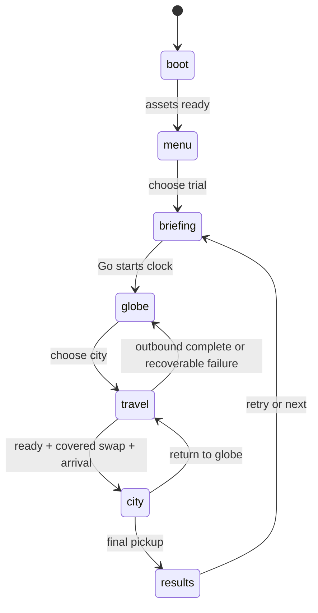

# Technical architecture

## Build choice and rationale

Use a **static browser game**: React + TypeScript + Vite for the app and UI; Three.js through React Three Fiber for 3D; Zustand for discrete run state; CSS for interface animation; native Web Audio or small local audio files for sound. Vitest handles pure rule tests; Playwright handles a few essential browser flows.

This fits text-based agent implementation and AI Studio's React output, and gives itch.io a small browser bundle. We are choosing it for this eight-hour project, not claiming it beats Unity or Godot generally. Do not change engines midway. Avoid Rapier, navigation libraries, GIS frameworks, routing frameworks, SSR, a database, or server infrastructure in P0.

A0 selects compatible installed dependency versions once, verifies peer dependencies, commits the lockfile and `.nvmrc`, and records actual versions. Do not have every agent independently run an unpinned scaffold command. Node 24.x is the planned baseline; the planning workspace has Node 24.19.0. Verify availability in Devin rather than assuming it.

## Intended source tree

```text
src/app/                 composition, SceneHost, adapters, error boundary — A0
src/shared/contracts.ts shared types/constants — A0
src/state/               run reducer/store, settings, persistence — A1
src/game/                player, collision, pickups, clock, score — A1
src/world/               globe, pins, travel camera, cloud cover — A2
src/cities/index.ts      explicit module registry — A0
src/cities/paris/        pure definition + scenery — A3
src/cities/giza/         pure definition + scenery — A4
src/ui/                  presentational screens, HUD, map, touch stick — A5
src/content/             validated targets, levels, seeded socket resolver — A6
public/assets/           local licensed assets; each contributor declares paths
scripts/                 package + release checks — A7; dependency changes A0
```

Do not create a monorepo for two scenes. Keep heavy generated exports and raw AI Studio project files outside the runtime source tree until reviewed.

## Runtime boundaries

| Module | Owns | Must not own |
|---|---|---|
| Run store / reducer | Phase, run ID, collected IDs, hints, penalties, result eligibility | Mesh geometry, DOM layout |
| Player controller | Position/velocity refs, collision, input sampling | React screen navigation or score formulas |
| Content resolver | Seed → validated objective/socket instances | Live AI requests or scene rendering |
| City module | Scenery and its pure collision/map/socket definition | Collection, score, input handlers, app state |
| SceneHost | One Canvas, active scene, component registry | A second copy of gameplay rules |
| TravelDirector | Camera animation and cover callbacks | Directly mutating score or completing an unverified run |
| UI | View models and callbacks | An independent timer, penalty balance or persistent run store |

The same `CityDefinition` generates collisions, map shapes and allowable socket locations. Rendering may simplify detail but cannot introduce invisible blockers. Pickups and the explorer are composed above city scenery by the game layer.

## State machine and travel ownership



Pause is an overlay with a saved phase, not another uncontrolled scene. Pause is available in active globe/city phases; hidden/blur during travel marks practice and freezes/resumes the transition timeline safely. Stop all player input while paused, loading or in a transition.

A transition carries a unique ID and run ID. A1 accepts callbacks only if both match the current pending transition. Loading completion from a canceled run must do nothing. `onCovered` is the one moment SceneHost swaps content; `onComplete` is the one moment it enables the destination. A2 reports events; A1 validates and advances state. A0 wires the components.

City modules are imported/prewarmed in the background after menu load. Keep only the active city rendered. On slower connections, hold the opaque cloud cover until ready and show a small loading status. On failure after an 8-second attempt, restore the globe with retry; keep collected items and do not charge an entry. A retry has a new transition token. Never present a blank screen or unresponsive spinner indefinitely.

## Globe-to-city illusion

We deliberately do not maintain a physically scaled continuous Earth/city simulation. The visible effect is continuous, built from a masked scene swap:

1. Rotate the globe toward the selected approximate geographic anchor, 0.35–0.45 s.
2. Move the camera toward that anchor while enlarging clouds and adding a soft wind sound, 0.45–0.6 s.
3. With the cloud overlay **fully opaque**, swap globe for the local city. Use the same dominant lighting and destination accent color. Do not swap visibly at 90% opacity.
4. Reveal the city from a higher camera position, ease into follow position over about 0.55 s, and enable input on completion.

Target total entry animation about 1.6 s excluding real loading. Exit is the reverse visual idea in about 0.7 s, then globe choice is playable. Reduced motion uses a roughly 0.2 s fade; the 5-second travel penalty stays identical. This preserves score fairness across settings and avoids motion discomfort.

One Canvas and renderer survive the swap. A single camera controller switches between globe, transition and city modes; no competing OrbitControls/useFrame writers. Globe drag/orbit is optional; clickable named pins and accessible city buttons are mandatory. Reject clicks on pins behind the globe. Do not label unopened cities as playable.

## Movement and collision

Coordinates: meters-like units, X east, Y up, Z south; north is -Z. Foot height is Y=0. Cities fit X/Z in [-72,72]. Player radius 0.8; pickup radius 2.0; walking speed 11 units/s; normalize diagonals. Ground remains flat in P0. Landmarks may be tall but collectible pedestals remain accessible at ground level.

Use a small kinematic circle controller against axis-aligned XZ rectangles. Expand each blocker by player radius and resolve axis movement with sliding. Constrain the player center to city bounds inset by the same radius so the explorer cannot leave the miniature. Use movement substeps short enough that maximum displacement is below half the player radius; cap accumulated simulation catch-up to avoid a spiral. Keep score clock accumulation independent of that cap. Validate corners, city edges, narrow gaps and high-speed diagonals. No full physics engine.

Camera initially follows at approximately `(0, 52, 36)` relative to player, looking at the player, with a 48-degree FOV. Tune for readable landmarks and enough map ahead; keep heading fixed. Prefer shorter buildings and wide streets to complex camera-occlusion systems. Use exponential damping based on delta time, not a fixed per-frame interpolation factor.

## State updates and rendering

Position, velocity, camera, glints and particles update through refs in the render loop. Discrete events go to the store. HUD elapsed time may update at 10 Hz; it does not need 60 React renders/s. Browser visibility/focus clears controls. Reset input on every scene transition, respawn, pause and retry.

Reuse materials/geometries. Instance repeated façades, trees, lamps and market props where useful. Avoid per-frame new vectors and setState. Cache or dispose owned GPU resources deliberately; do not dispose resources shared by another city. A repeated-travel test checks for accumulating meshes/listeners.

## Performance targets, not measured claims

- Desktop: aim at stable 60 fps on a typical recent laptop at 1280×720; review p95 frame time ≤25 ms with median near 16.7 ms.
- Mobile landscape: aim for stable 30 fps on the actual tested device; review p95 ≤40 ms. Only claim mobile support after testing.
- Per rendered city: target under 150 draw calls and about 150k triangles; these are budgets, not guarantees.
- Default DPR cap 1.5, low quality 1.0. Single shadow-casting directional light only if stable; use blob shadows as fallback. No SSAO, depth-of-field or expensive full-screen bloom in P0.
- Initial compressed transfer target <15 MB; full ZIP target <25 MB. Initial usable menu target <5 s on a documented connection. No external asset/CDN/font calls during a run.

Measure before optimizing. If over budget, first remove excessive shadow casters/effects, then reduce DPR and instance props. Keep landmark silhouettes intact.

## Storage, packaging and recovery

Save settings and valid local bests under a versioned key, e.g. `glint:v1`. Key bests by `levelId + levelVersion + seed + rulesVersion`. Guard JSON parsing and storage writes; schema mismatch resets only incompatible data. A disabled storage environment still plays normally with a visible “session-only best” message.

Set Vite `base: './'`. Prefer imported assets; public assets use `import.meta.env.BASE_URL` plus a relative path. Use no root-relative `/assets/...`, CDN imports or history-router paths. Package `dist` contents, never the source repo or `node_modules`. Preview via HTTP and then test the actual itch iframe.

Catch module/render errors with a visible retry/back-to-menu path. If WebGL is unavailable, show a helpful compatibility message; do not mark that environment as successfully supported. Audio must wait for a user gesture. Fullscreen failure leaves the embedded game usable.
